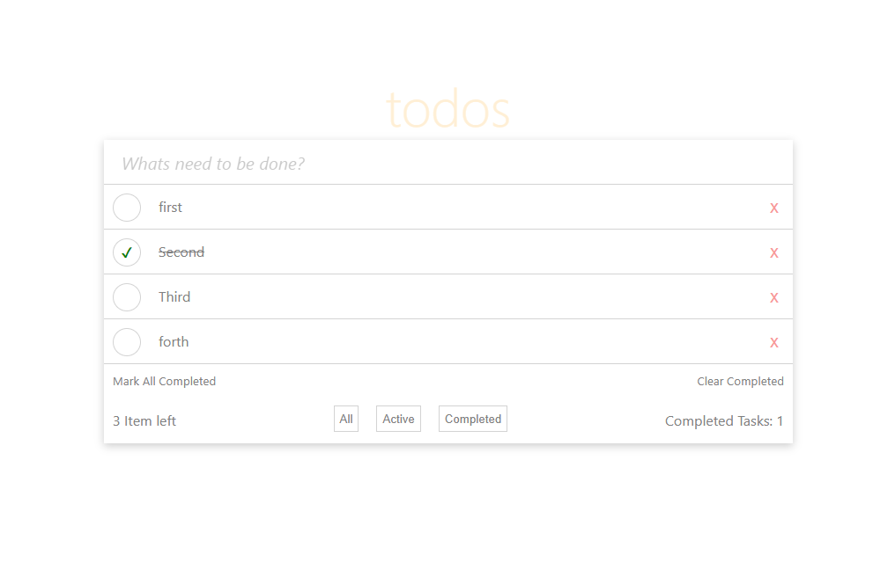

# Todo App with React and TypeScript

Todo app built using React and TypeScript. It allows users to add, complete, delete, and modify tasks. The app also provides filtering options to view active tasks, completed tasks, or all tasks.

## Features

### Add new todos by entering text in the input field and clicking Enter key.

### Mark a todo as completed or undo the completion by clicking on the todo text itself.

### Delete a todo by clicking the "X" button.

### Mark all todos as completed by clicking the "Mark All Completed" button.

### Clear completed todos by clicking the "Clear Completed" button.

### Filter todos to show only active tasks, completed tasks, or all tasks.

## Usage

### Clone the repository and navigate to the project directory.

### Install dependencies by running npm install.

### Start the development server with npm start.

### Open the app in your browser at http://localhost:3000.

